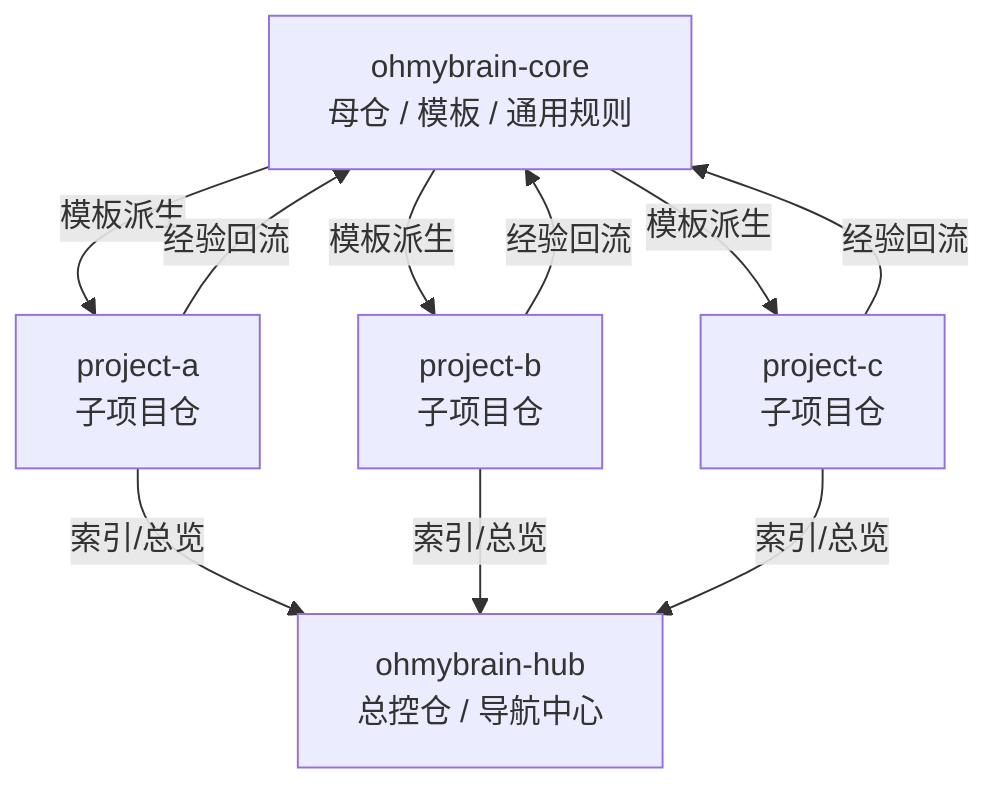

# ohmybrain-core / ohmybrain-hub / project-* 目录关系图

下面是 `ohmybrain-core / ohmybrain-hub / project-*` 的目录关系图与说明。

## 总体关系图

```text
                           ┌──────────────────────┐
                           │   ohmybrain-core     │
                           │      母仓 / 模板      │
                           │----------------------│
                           │ 通用规则              │
                           │ CLAUDE.md 模板       │
                           │ .claude/rules        │
                           │ .claude/skills       │
                           │ .claude/hooks        │
                           │ wiki/spec/plan 骨架  │
                           │ scripts/CI 模板      │
                           └──────────┬───────────┘
                                      │ 作为模板派生
                    ┌─────────────────┼─────────────────┐
                    │                 │                 │
                    ▼                 ▼                 ▼
          ┌────────────────┐ ┌────────────────┐ ┌────────────────┐
          │   project-a    │ │   project-b    │ │   project-c    │
          │    子项目仓     │ │    子项目仓     │ │    子项目仓     │
          │----------------│ │----------------│ │----------------│
          │ 项目级规则      │ │ 项目级规则      │ │ 项目级规则      │
          │ 项目 wiki       │ │ 项目 wiki       │ │ 项目 wiki       │
          │ specs/plans    │ │ specs/plans    │ │ specs/plans    │
          │ src/tests      │ │ src/tests      │ │ src/tests      │
          │ 业务代码        │ │ 业务代码        │ │ 业务代码        │
          └────────┬───────┘ └────────┬───────┘ └────────┬───────┘
                   │                  │                  │
                   └──────────┬───────┴──────────┬───────┘
                              ▼                  ▼
                     ┌────────────────────────────────┐
                     │        ohmybrain-hub          │
                     │      总控仓 / 导航中心         │
                     │--------------------------------│
                     │ 所有项目索引                   │
                     │ 项目状态总览                   │
                     │ 链接到各子项目                 │
                     │ 跨项目知识导航                 │
                     │ 可选 submodule / 文档索引      │
                     └────────────────────────────────┘
```

## 你可以这样理解

```text
ohmybrain-core = 母仓
负责“默认应该长什么样”

project-* = 子项目
负责“这次具体做什么、交付什么”

ohmybrain-hub = 总控仓
负责“把所有项目串起来看”
```

## 更细一点的目录关系图

### 1. `ohmybrain-core`

```text
ohmybrain-core/
├─ README.md
├─ template/
│  ├─ CLAUDE.md
│  ├─ .claude/
│  │  ├─ rules/
│  │  ├─ skills/
│  │  ├─ hooks/
│  │  └─ settings.json
│  ├─ wiki/
│  │  ├─ index.md
│  │  └─ log.md
│  ├─ specs/
│  ├─ plans/
│  ├─ scripts/
│  └─ .github/workflows/
├─ docs/
│  ├─ principles/
│  ├─ playbooks/
│  └─ conventions/
└─ changelog/
```

它的职责是：

```text
定义模板
沉淀通用方法
维护可复用 harness
```

### 2. `project-*`

```text
project-a/
├─ CLAUDE.md
├─ .claude/
│  ├─ rules/
│  ├─ skills/
│  ├─ hooks/
│  └─ settings.json
├─ wiki/
│  ├─ index.md
│  ├─ log.md
│  ├─ concepts/
│  ├─ architecture/
│  └─ source-summaries/
├─ specs/
├─ plans/
├─ src/
├─ tests/
├─ scripts/
└─ .github/workflows/
```

它的职责是：

```text
承载具体业务
维护项目知识
完成开发闭环
把经验再反哺母仓
```

### 3. `ohmybrain-hub`

```text
ohmybrain-hub/
├─ README.md
├─ projects/
│  ├─ project-a -> 链接/子模块/说明
│  ├─ project-b -> 链接/子模块/说明
│  └─ project-c -> 链接/子模块/说明
├─ dashboards/
│  ├─ active-projects.md
│  ├─ project-status.md
│  └─ roadmap.md
├─ cross-wiki/
│  ├─ shared-concepts.md
│  ├─ shared-decisions.md
│  └─ common-incidents.md
└─ docs/
   ├─ how-to-start-a-new-project.md
   └─ sync-back-to-core.md
```

它的职责是：

```text
统一导航
总览所有项目
汇总跨项目经验
```

## 三者之间的数据流

```text
1. ohmybrain-core 提供模板和规则
   ↓
2. 新项目 project-* 从 core 派生
   ↓
3. project-* 在项目里做知识闭环 + 开发闭环
   ↓
4. 成熟经验再回写到 ohmybrain-core
   ↓
5. ohmybrain-hub 负责把所有项目统一串起来展示
```

## Mermaid 版



## 最推荐的使用顺序

```text
第一步：先建 ohmybrain-core
第二步：每个新项目从 core 创建 project-*
第三步：项目多了以后，再补 ohmybrain-hub
```

因为 `hub` 更像“总控台”，不是最开始必须有的。
