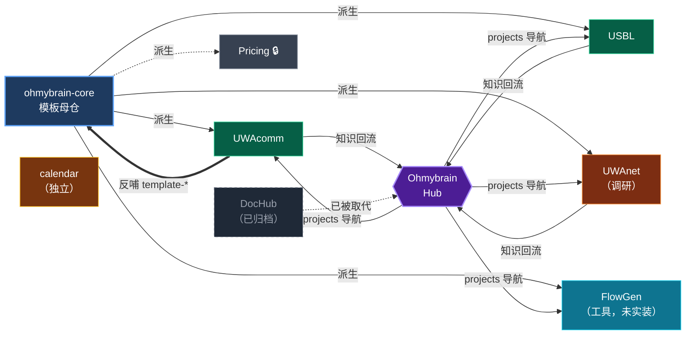
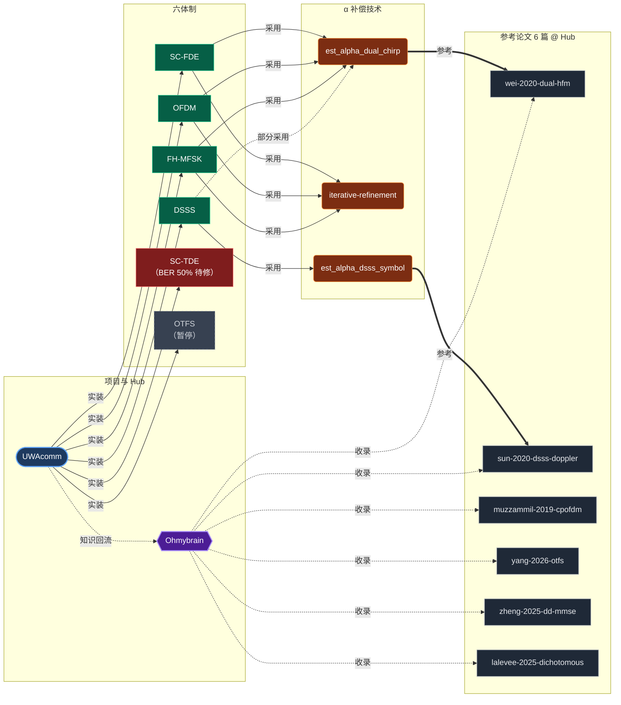

# MCP 知识图谱快照

## 定位

[[memory-stack]] 第 4 层（MCP memory server）的 Mermaid 可视化快照，供 Obsidian 直接预览。原始数据存于 `C:\Users\zazn\.claude\memory\graph.jsonl`。

> [!warning] 图谱层休眠（2026-06-24 入会自检（六）标注）
> `graph.jsonl` 自 **2026-05-12** 起停止同步，本快照内容冻结于 2026-04-23 v3。**MCP memory 图谱层已事实休眠（dormant）**——当前活跃记忆层 = Layer 3 auto-memory（`MEMORY.md`）+ Layer 5 Hub wiki，二者已覆盖跨会话 + 人类可读 + 关系网需求。本页保留作历史快照，不再随会话更新；如需复活图谱层另起 spec。见 [[memory-stack]] § Layer 4。

**当前规模**（2026-04-23 晚更 v3，已冻结）：**24 实体 + 36 关系**，覆盖两个主题：

- 🔵 **图谱 A — Ohmybrain 生态**（9 实体 × 13 关系，+FlowGen 工具项目）
- 🟢 **图谱 B — UWAcomm α 补偿栈**（17 实体 × 23 关系）

两图通过 **UWAcomm** + **Ohmybrain** 两个共享节点桥接（不同 observation 累积，同节点两视角）。

## 刷新方法

- **会话内让 Claude 重绘** — "把当前 MCP graph 重新渲染到 `memory-graph.md`"
- **读原始数据** — `cat C:/Users/zazn/.claude/memory/graph.jsonl`
- **自动同步 Obsidian wikilink 投影** — `python scripts/generate_mcp_entities.py`（生成 `wiki/mcp-entities/` 下节点笔记）

增删实体或关系后，**记得回来刷新本页**。

---

## 图谱 A — Ohmybrain 生态（9 + 13）

### 实体（9）

| Name | Type | 状态 | 关键观测 |
|------|------|------|---------|
| ohmybrain-core | repo_template | 活跃 | `D:\Claude\ohmybrain-core`，template-* + new-project-sop |
| Ohmybrain | knowledge_hub | 活跃 | Hub，无 src/ 无 specs/，知识终点 |
| UWAcomm | project | 活跃 | `TechReq/UWAcomm`，派生自 core，反哺 template |
| USBL | project | 活跃 | `TechReq/USBL`，P2 完成 |
| UWAnet | project | 前期调研 | `TechReq/UWAnet`，ns-3/Aqua-Sim-NG |
| **FlowGen** | **tool_project** | **未实装** | **`Tools/FlowGen`，2026-04-23 SOP 派生，Mermaid 流程图工具** |
| Pricing | private_project | 活跃不公开 | 军用软件报价，不回流 Hub |
| DocHub | archived_repo | 已归档 2026-04-13 | 被 Ohmybrain 取代 |
| calendar | notes | 独立 | 日程 Obsidian vault |

### 关系（13）

| From | Type | To |
|------|------|------|
| ohmybrain-core | 派生 | UWAcomm / USBL / UWAnet / Pricing / **FlowGen**（5）|
| UWAcomm / USBL / UWAnet | 知识回流到 | Ohmybrain（3）|
| UWAcomm | template-* 改进回哺 | ohmybrain-core |
| Ohmybrain | projects 导航 | UWAcomm / USBL / UWAnet / **FlowGen**（4）|
| DocHub | 已被取代 | Ohmybrain |

---

## 图谱 B — UWAcomm α 补偿栈（17 + 23）

### 实体分类

**Schemes（6）**

| Name | 改前 α 上限 | 改后 α 上限 | D α=+3e-2 BER | 状态 |
|------|:----------:|:----------:|:-------------:|-----|
| SC-FDE | <1e-4 | **3e-2** | 5.4% | 3 patch 突破 |
| OFDM | <1e-4 | 1e-2 | 11.4% | 通过 |
| DSSS | <5e-4 | 3e-3（+3e-2 特殊）| **2.2%** | Sun-2020 符号级 |
| FH-MFSK | 5e-4 | 1e-2 | 21% | 通过 |
| SC-TDE | <1e-4 | 失败（BER 50%）| - | 独立 spec 待开 |
| OTFS | - | - | - | 暂停 |

**Techniques（3）** / **Papers（6 @ Hub）** — 详见对应 `mcp-entities/*.md` 节点笔记。

### 关系（23）

| From | Type | To |
|------|------|------|
| UWAcomm | 实装 | SC-FDE / OFDM / SC-TDE / OTFS / DSSS / FH-MFSK（6）|
| UWAcomm | 知识回流到 | Ohmybrain |
| SC-FDE / OFDM / FH-MFSK | 采用 | est_alpha_dual_chirp + iterative-refinement（各 2）|
| DSSS | 采用 / 部分采用 | est_alpha_dsss_symbol / est_alpha_dual_chirp |
| est_alpha_dual_chirp / est_alpha_dsss_symbol | 参考自 | wei-2020-dual-hfm / sun-2020-dsss-doppler |
| Ohmybrain | 收录 | 6 篇 paper |

---

## 共享节点（两图交集）

| 节点 | 在图谱 A | 在图谱 B |
|---|---|---|
| **UWAcomm** | project，派生自 core，反哺 template-*，回流 Hub | 实装 6 体制 |
| **Ohmybrain** | Hub，收录项目导航 + 知识终点 | 收录 6 篇 paper |

两图同节点通过 observation 累积 —— 不建双节点，只加 observation。

## 相关页面

- [[memory-stack]] — 记忆栈 5 层总览（本页是 Layer 4 可视化）
- [[_index]] — MCP Entities wikilink 投影索引
- [[system-overview]] — 三仓架构总览（图谱 A 的事实源）
- [[doppler-estimation-methods]] — 方法学 concept（图谱 B 的跨论文抽取）
- [[mermaid-js-mermaid]] — 本页两张图谱用的 `flowchart LR` DSL 渲染器(Mermaid)源仓摘要

## 修订记录

- 2026-04-23 晚：扩展为双主题 — 新增图谱 A（Ohmybrain 生态），原图谱作为 B 保留；总规模 17→23 实体，23→34 关系
- 2026-04-23 早：首次创建快照（17 实体 + 23 关系，UWAcomm α 补偿栈单主题）
